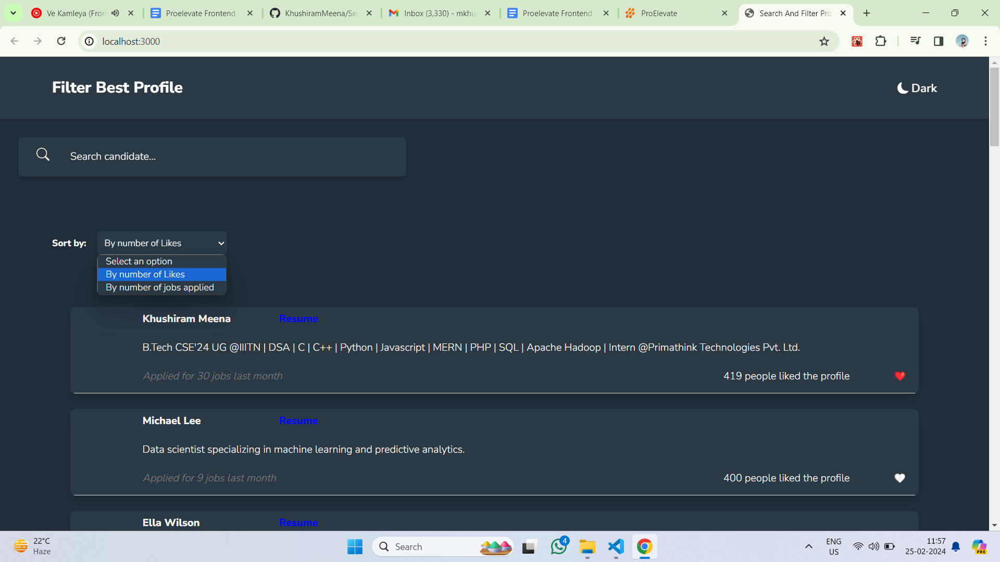
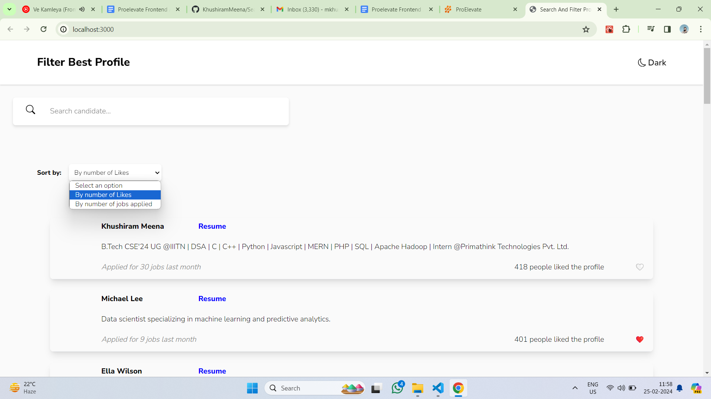
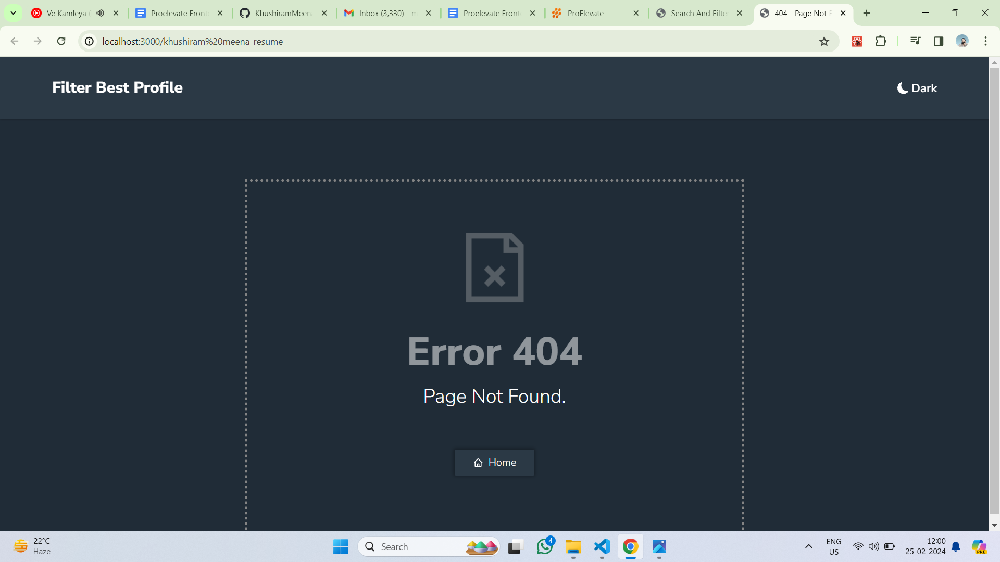

# Frontend Assignment

## Installation Process

1. **Clone the Repository:**
    ```bash
    git clone https://github.com/KhushiramMeena/SearchAndFilter.git
    ```

2. **Navigate to the Project Directory:**
    ```bash
    cd SearchAndFilter
    ```

3. **Install Dependencies:**
    ```bash
    npm install
    ```

4. **Start the project**
    ```bash
    npm run dev
    ```
## About Data
 **src/data.json**
 ```bash
    [
 
  {
    "applicant_name": "Arsh Sharma",
    "resume": "resume_link",
    "highlight": "Computer Science graduate with expertise in web development and programming languages such as Python and JavaScript.",
    "applied_for_jobs": 5,
    "number_of_likes": 20
  },
  {
    "applicant_name": "Khushiram Meena",
    "resume": "resume_link",
    "highlight": "B.Tech CSE'24 UG @IIITN | DSA | C | C++ | Python | Javascript | MERN | PHP | SQL | Apache Hadoop | Intern @Primathink Technologies Pvt. Ltd.",
    "applied_for_jobs": 30,
    "number_of_likes": 418
  }
    ]
    ```

## Screenshots
**Home Page (Dark-Mode)**


**Light-Mode**


**Error Handled**

## Deployed on vercel
See live at [https://search-and-filter-profiles.vercel.app/](https://search-and-filter-profiles.vercel.app/)

